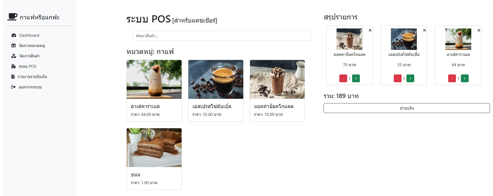

# ระบบจัดการสินค้ากาแฟ (Coffee Management System)(ยังไม่เสร็จขี้เกียจก่อน)

## รูปตัวอย่าง



ระบบจัดการสินค้ากาแฟที่พัฒนาด้วย PHP, MySQL, Bootstrap และ SweetAlert แอปพลิเคชันนี้ช่วยให้ผู้ใช้สามารถจัดการสินค้ากาแฟ หมวดหมู่ และแสดงรายการสินค้าต่าง ๆ ได้อย่างง่ายดาย

## คุณสมบัติ

- **จัดการสินค้ากาแฟ**: เพิ่ม แก้ไข และลบสินค้ากาแฟ รวมถึงชื่อ ราคา หมวดหมู่ และอัปโหลดรูปภาพสินค้า
- **จัดการหมวดหมู่**: เพิ่ม แก้ไข และลบหมวดหมู่ของกาแฟ
- **แจ้งเตือนเรียลไทม์**: ใช้ SweetAlert สำหรับแจ้งเตือนผู้ใช้เมื่อมีการดำเนินการ เช่น การเพิ่ม แก้ไข หรือลบ
- **ออกแบบให้ตอบสนอง**: ใช้ Bootstrap สำหรับการออกแบบที่ตอบสนองทุกอุปกรณ์
- **การจัดการรูปภาพ**: ระบบจะจัดการการอัปโหลดรูปภาพและตั้งชื่อรูปภาพตาม ID ของสินค้าโดยอัตโนมัติเพื่อหลีกเลี่ยงการซ้ำกัน

## เทคโนโลยีที่ใช้

- **Backend**: PHP (โครงสร้าง OOP)
- **ฐานข้อมูล**: MySQL
- **Frontend**: HTML5, CSS3, Bootstrap 5
- **JavaScript Libraries**: jQuery, SweetAlert2
- **Version Control**: Git, GitHub

## การติดตั้ง

1. คลอนโปรเจกต์นี้:

    ```bash
    git clone https://github.com/Mosquito5142/coffeeWebAPP.git
    ```

2. เข้าไปยังโฟลเดอร์โปรเจกต์:

    ```bash
    cd coffeeWebAPP
    ```

3. นำเข้าไฟล์ SQL ในฐานข้อมูล ซึ่งอยู่ใน `database/coffeeapp.sql`

4. ตั้งค่าการเชื่อมต่อฐานข้อมูลในไฟล์ `config/config.php`:

    ```php
    class Config {
        public static $DB_HOST = 'localhost';
        public static $DB_NAME = 'your_database_name';
        public static $DB_USER = 'your_database_user';
        public static $DB_PASSWORD = 'your_database_password';
    }
    ```

5. เริ่มต้นเซิร์ฟเวอร์ PHP ของคุณ และเข้าถึงระบบผ่าน `http://localhost/coffeeWebAPP`

## การใช้งาน

### การจัดการสินค้ากาแฟ

1. ไปที่หน้าจัดการสินค้า
2. เพิ่ม แก้ไข หรือลบสินค้ากาแฟ
3. สามารถอัปโหลดรูปภาพสินค้าใหม่ ระบบจะตั้งชื่อรูปภาพตาม ID ของสินค้าอัตโนมัติ

### การจัดการหมวดหมู่

1. ไปที่หน้าจัดการหมวดหมู่
2. เพิ่ม แก้ไข หรือลบหมวดหมู่ของกาแฟผ่านหน้าต่างโมดัล

## รูปตัวอย่าง


## ใบอนุญาต

โปรเจกต์นี้ได้รับอนุญาตภายใต้ MIT License - ดูไฟล์ [LICENSE](LICENSE) สำหรับรายละเอียดเพิ่มเติม

## การร่วมพัฒนา

สามารถส่ง Pull Request เข้ามาได้ สำหรับการเปลี่ยนแปลงใหญ่กรุณาเปิดประเด็นเพื่อพูดคุยก่อน

---

# Coffee Management System

A web-based coffee management system built with PHP, MySQL, Bootstrap, and SweetAlert. This application allows users to manage coffee products, categories, and display product lists with ease.

## Features

- **Manage Coffee Products**: Add, edit, and delete coffee products, including name, price, category, and image upload functionality.
- **Manage Categories**: Create, edit, and delete coffee categories.
- **Real-time Feedback**: Utilizes SweetAlert for real-time feedback after performing actions like adding, editing, or deleting products or categories.
- **Responsive Design**: Built with Bootstrap for a fully responsive user interface.
- **Image Handling**: Automatically handles image uploads and ensures product images are named based on the coffee ID to avoid duplication.

## Tech Stack

- **Backend**: PHP (OOP-based structure)
- **Database**: MySQL
- **Frontend**: HTML5, CSS3, Bootstrap 5
- **JavaScript Libraries**: jQuery, SweetAlert2
- **Version Control**: Git, GitHub

## Installation

1. Clone this repository:

    ```bash
    git clone https://github.com/Mosquito5142/coffeeWebAPP.git
    ```

2. Navigate to the project directory:

    ```bash
    cd coffeeWebAPP
    ```

3. Import the SQL file to your database. You can find the file in `database/coffeeapp.sql`.

4. Configure the database connection in `config/config.php`:

    ```php
    class Config {
        public static $DB_HOST = 'localhost';
        public static $DB_NAME = 'your_database_name';
        public static $DB_USER = 'your_database_user';
        public static $DB_PASSWORD = 'your_database_password';
    }
    ```

5. Start your PHP server and access the system via `http://localhost/coffeeWebAPP`.

## Usage

### Managing Coffee Products

1. Navigate to the **Products** page.
2. Add, edit, or delete coffee products.
3. Upload a new image when editing a product, and the system will automatically rename it using the coffee ID to avoid conflicts.

### Managing Categories

1. Navigate to the **Categories** page.
2. Add, edit, or delete coffee categories in a modal window.

## Screenshots


## License

This project is licensed under the MIT License - see the [LICENSE](LICENSE) file for details.

## Contributing

Pull requests are welcome. For major changes, please open an issue first to discuss what you would like to change.

## การอัปโหลดรูปภาพ

ในระบบนี้ คุณสามารถอัปโหลดรูปภาพสินค้าผ่านทางฟอร์มเพิ่มหรือแก้ไขสินค้า โดยระบบจะทำการบันทึกไฟล์รูปภาพลงในโฟลเดอร์ `img/` และตั้งชื่อไฟล์ตาม `ID` ของสินค้ากาแฟนั้น ๆ โดยอัตโนมัติ เพื่อหลีกเลี่ยงการซ้ำกันของชื่อไฟล์

### ขั้นตอนการอัปโหลดรูปภาพ:

1. เลือกรูปภาพจากเครื่องคอมพิวเตอร์ของคุณ (ไฟล์ `.jpg` เท่านั้น)
2. รูปภาพที่อัปโหลดจะถูกบันทึกลงในโฟลเดอร์ `img/` และระบบจะตั้งชื่อรูปภาพให้ตรงกับ `ID` ของสินค้านั้น
3. หากคุณแก้ไขรูปภาพสินค้าใหม่ ระบบจะทำการลบรูปภาพเก่าที่ใช้ `ID` เดียวกันออก และแทนที่ด้วยรูปใหม่ที่คุณอัปโหลด

## Image Upload Handling

In this system, you can upload product images via the add or edit product form. The system will automatically save the uploaded image to the `img/` folder and name the file using the coffee product's `ID` to avoid filename conflicts.

### Steps for Uploading Images:

1. Select an image from your computer (only `.jpg` files are allowed)
2. The uploaded image will be stored in the `img/` folder, and the system will automatically rename it based on the product's `ID`
3. When you update a product's image, the system will remove the old image (with the same `ID`) and replace it with the new one

## Project Updates

1. Navigate to the **Pull Requests** tab in your GitHub repository
2. Create a new branch to add features or fix bugs
3. Once development is complete, open a pull request to merge it into the main branch
